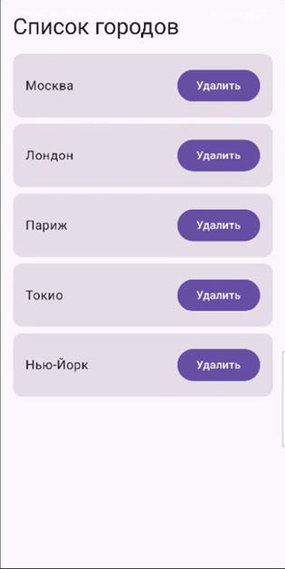

# MDK 01.03 Разработка мобильных приложений

**Специальность:** Информационные системы и программирование (ИП)

**Фамилия, имя:** [Петросян Владислав]

**Вариант:** 15

---

## Задание

Создать список городов с возможностью удаления.

**Требования:**
- Использовать `LazyColumn` для отображения списка
- Исходный список: Москва, Лондон, Париж, Токио, Нью-Йорк
- Рядом с каждым элементом — кнопка «Удалить»
- При нажатии на кнопку элемент удаляется из списка
- Если список пуст — отображается текст «Список пуст»

---

## Скриншот работы приложения




---

## Код решения

Основной файл приложения `MainActivity.kt`:

```kotlin
package com.example.mdk0103_variant15

import android.os.Bundle
import androidx.activity.ComponentActivity
import androidx.activity.compose.setContent
import androidx.compose.foundation.layout.*
import androidx.compose.foundation.lazy.LazyColumn
import androidx.compose.foundation.lazy.items
import androidx.compose.material3.*
import androidx.compose.runtime.*
import androidx.compose.ui.Alignment
import androidx.compose.ui.Modifier
import androidx.compose.ui.unit.dp

class MainActivity : ComponentActivity() {
    override fun onCreate(savedInstanceState: Bundle?) {
        super.onCreate(savedInstanceState)
        setContent {
            MaterialTheme {
                Surface(
                    modifier = Modifier.fillMaxSize(),
                    color = MaterialTheme.colorScheme.background
                ) {
                    CityListScreen()
                }
            }
        }
    }
}

@Composable
fun CityListScreen() {
    var cities by remember {
        mutableStateOf(
            mutableListOf("Москва", "Лондон", "Париж", "Токио", "Нью-Йорк")
        )
    }

    Column(
        modifier = Modifier
            .fillMaxSize()
            .padding(16.dp)
    ) {
        Text(
            text = "Список городов",
            style = MaterialTheme.typography.headlineMedium,
            modifier = Modifier.padding(bottom = 16.dp)
        )

        if (cities.isEmpty()) {
            Box(
                modifier = Modifier.fillMaxSize(),
                contentAlignment = Alignment.Center
            ) {
                Text(text = "Список пуст")
            }
        } else {
            LazyColumn(verticalArrangement = Arrangement.spacedBy(8.dp)) {
                items(cities) { city ->
                    Card(modifier = Modifier.fillMaxWidth()) {
                        Row(
                            modifier = Modifier
                                .fillMaxWidth()
                                .padding(16.dp),
                            horizontalArrangement = Arrangement.SpaceBetween,
                            verticalAlignment = Alignment.CenterVertically
                        ) {
                            Text(text = city, modifier = Modifier.weight(1f))
                            Button(onClick = {
                                cities = cities.filter { it != city }.toMutableList()
                            }) {
                                Text("Удалить")
                            }
                        }
                    }
                }
            }
        }
    }
}
